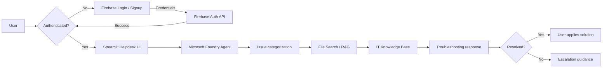
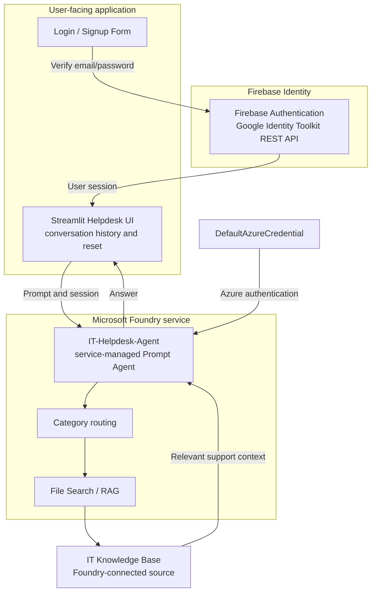

# IT Helpdesk Agent

An AI-powered first-level IT support chat application built with Streamlit and Microsoft Foundry.

## Overview

The IT Helpdesk Agent gives users a conversational way to describe common technical issues and receive troubleshooting guidance. Streamlit provides the chat experience, while a service-managed Microsoft Foundry agent processes the request and returns a response using its configured instructions and knowledge sources.

The project is designed to reduce repetitive first-line support work by helping users find relevant troubleshooting steps before an issue needs human escalation.

## System Workflow



In this repository, access is secured with Firebase Authentication. Unauthenticated users are presented with a clean login/signup interface. Once authenticated, the application sends the user's prompt and current session to `IT-Helpdesk-Agent`. Categorization and retrieval are responsibilities of the Foundry agent configuration and its connected knowledge sources; they are not implemented as separate local Python modules.

## Architecture



- **Firebase Authentication** manages user identity with secure email/password account creation, authentication, and session control.
- **Streamlit** renders the authentication gates, chat interface, stores messages in session state, and starts a new conversation when requested.
- **Microsoft Foundry** hosts the existing `IT-Helpdesk-Agent` and handles the service-managed agent run.
- **File Search / RAG** represents retrieval configured for the Foundry agent. The repository does not contain a local retrieval pipeline.
- **IT Knowledge Base** is the support material connected to the agent configuration. No knowledge-base files or database are stored in this repository.

## Key Features

- Secure **Firebase Authentication** (Email & Password login, signup, session persistence, and logout)
- **User Profile Dashboard**: Dedicated profile view displaying authenticated user identity, account status, and individual IT helpdesk activity (total questions, distinct conversations, recent inquiries with categories and timestamps)
- **User Data Isolation**: Server-enforced per-user isolation backed by Cloud Firestore and security rules (`/users/{uid}/helpdesk_activity`)
- Direct conversation switching from Profile activity history
- Complete access gating: unauthenticated users cannot access chat, diagnostics, or profile dashboards
- Password visibility toggle and client-side form validation
- Conversational IT support through a Streamlit chat interface
- Persistent conversation messages during the current Streamlit session
- New conversation control that clears the current messages and agent session
- Microsoft Foundry agent integration using the configured project endpoint
- Azure authentication through `DefaultAzureCredential`
- User-visible error handling when the helpdesk agent cannot be reached
- SQLite-backed analytics for real request outcomes, latency, volume, and sanitized failure types

## Support Analytics and Privacy

The in-app **Support analytics** view provides an IT support analytics dashboard that reads actual request events, conversations, user feedback, and tickets from the local `chat_history.db` SQLite database.

The dashboard displays:
- **Support Overview**: Number of distinct support conversations, total support requests, support ticket counts, and agent success rate.
- **Resolved vs. Escalated Issues**: Direct comparison of user-confirmed issue resolutions against unresolved issues requiring escalation, including resolution and escalation rates with side-by-side visualization.
- **Issue Category Distribution**: Distribution of IT issue categories, total categorized issues, category breakdowns, and identification of the most common IT issue category.
- **Usage Trends Over Time**: Daily timeline of support requests and active conversations across selectable time ranges (Last 24 hours, Last 7 days, Last 30 days, All time).
- **System Performance & Observability**: Average response latency, nearest-rank P95 response latency, successful vs. fallback requests, and sanitized failure breakdowns (error stage, error type, and latency).

### Privacy Guarantee
All analytics metrics use structured, aggregated data only. User prompts, full message transcripts, free-form feedback comments, access tokens, and credentials are never stored in or exposed by the analytics dashboard.

## Supported IT Categories

- Wi-Fi / Network
- VPN
- Password / Account
- Printer
- Email
- Software Installation

These categories describe the intended first-level support scope. The repository does not contain a separate local category-classification model.

## Tech Stack

- Python
- Streamlit
- Firebase Authentication (Google Identity Toolkit REST API v1)
- `requests`
- Microsoft Foundry Agent Framework
- Azure Identity
- `python-dotenv`
- `unittest` and Python AST parsing for the smoke test

## Knowledge Base

The application is prepared to work with knowledge sources connected to the Microsoft Foundry agent, including a File Search / RAG workflow. The actual knowledge-base content and retrieval configuration are managed outside this repository and are not embedded in `app.py`.

## Project Structure

```text
.
├── app.py                           # Streamlit UI, auth view, profile view, and Foundry agent integration
├── firebase_auth.py                 # Firebase Authentication REST client and form validation
├── firestore_service.py             # Cloud Firestore REST client for isolated user activity tracking
├── firestore.rules                  # Production Firestore Security Rules (per-user data isolation)
├── telemetry_store.py               # Request telemetry and analytics queries
├── history_store.py                 # SQLite conversation message storage
├── requirements.txt                 # Python dependencies
├── test_app.py                      # Application smoke and telemetry tests
├── test_firebase_auth.py            # Firebase authentication and session unit tests
├── test_profile_dashboard.py        # Profile dashboard and user data isolation tests
├── .streamlit/
│   └── secrets.toml.example         # Template for Firebase credentials configuration
└── .env                             # Local configuration; do not commit secrets
```

## Setup and Run

### 1. Python Environment

1. Create and activate a Python virtual environment:

   ```bash
   python -m venv .venv
   ```

   On Windows:

   ```powershell
   .venv\Scripts\Activate.ps1
   ```

2. Install the dependencies:

   ```bash
   pip install -r requirements.txt
   ```

### 2. Firebase Authentication Setup

1. Go to the [Firebase Console](https://console.firebase.google.com/) and create or open your Firebase project.
2. Navigate to **Build > Authentication** and click **Get started**.
3. Under the **Sign-in method** tab, select **Email/Password**.
4. Enable **Email/Password** and click **Save**.
5. Navigate to **Project Settings** (gear icon) > **General** tab.
6. Scroll down to **Your apps** and register a Web app (or copy config from an existing web app).
7. Create `.streamlit/secrets.toml` in your project root by copying the template:

   On Windows (PowerShell):
   ```powershell
   Copy-Item .streamlit\secrets.toml.example .streamlit\secrets.toml
   ```

8. Fill in your project credentials in `.streamlit/secrets.toml`:

   ```toml
   [firebase]
   api_key = "AIzaSy..."
   auth_domain = "your-project-id.firebaseapp.com"
   project_id = "your-project-id"
   storage_bucket = "your-project-id.appspot.com"
   messaging_sender_id = "123456789012"
   app_id = "1:123456789012:web:abcdef1234567890"
   ```

   *(Alternatively, credentials can be set via environment variables such as `FIREBASE_API_KEY` and `FIREBASE_PROJECT_ID`).*

### 3. Cloud Firestore Setup & Security Rules

1. In the [Firebase Console](https://console.firebase.google.com/), navigate to **Build > Firestore Database**.
2. Click **Create database**, select **Native mode**, and choose a Cloud region near you.
3. Once created, click the **Rules** tab.
4. Replace the default rules with the contents of [`firestore.rules`](file:///e:/IT-help-desk-agent-/firestore.rules):

   ```javascript
   rules_version = '2';
   service cloud.firestore {
     match /databases/{database}/documents {
       // Users can only read and write their own profile and helpdesk activity
       match /users/{userId}/{document=**} {
         allow read, write: if request.auth != null && request.auth.uid == userId;
       }
       // Deny all other collections
       match /{document=**} {
         allow read, write: false;
       }
     }
   }
   ```

5. Click **Publish**. This guarantees that all activity records under `/users/{uid}/helpdesk_activity` are strictly accessible only by the authenticated owner (`request.auth.uid == userId`).

### 4. Microsoft Foundry Configuration

Create a local `.env` file with your Foundry project endpoint. Do not commit this file or its values.

```env
FOUNDRY_PROJECT_ENDPOINT=<your-foundry-project-endpoint>
FOUNDRY_AGENT_VERSION=<optional-agent-version>
```

Ensure `DefaultAzureCredential` can authenticate with Azure in your development environment.

### 5. Start the Application

```bash
streamlit run app.py
```

Open your browser at `http://localhost:8501`. If you are not signed in, the application will display the Sign In / Create Account screen.

### 6. Run Automated Tests

Run the full test suite (Foundry agent smoke tests, telemetry tests, Firebase authentication tests, and Profile dashboard isolation tests):

```bash
python -m unittest test_profile_dashboard.py test_firebase_auth.py test_app.py
```

## Database & Data Storage

The application uses two complementary storage layers:

- **SQLite (`chat_history.db`)** is used for local application data, including conversation history, messages, request telemetry, user feedback, and ticket-related records. The Support Analytics dashboard reads structured data from this database to display support requests, conversations, resolution status, issue categories, usage trends, and system performance metrics.

- **Cloud Firestore** is used for authenticated user-specific activity and cloud-synced profile information. User activity is stored under `/users/{uid}/helpdesk_activity` and protected using Firestore security rules, ensuring that an authenticated user can only access their own records.

This separation allows the application to keep operational and analytics data in SQLite while using Firebase/Firestore for cloud-based user activity and data isolation.

## Security Notes

- **Credentials Protection**: Never commit `.env`, `.streamlit/secrets.toml`, or service-account JSON files to version control. Both are ignored in `.gitignore`.
- **Firebase API Key**: The Firebase API key is a public identifier for the Firebase project client application. No private keys or service account credentials are required or exposed in the frontend.
- **Password Security**: Passwords are sent directly over HTTPS to the Firebase Authentication API authority (`identitytoolkit.googleapis.com`). Plaintext passwords are never logged, stored in session state, or written to SQLite.
- **Session Isolation**: Authentication state is stored in `st.session_state.auth_user`. Unauthenticated sessions are stopped immediately via `st.stop()`, preventing unauthenticated access to the helpdesk UI, conversation store, and Foundry Agent.

## Example User Queries

- “My laptop can see the Wi-Fi network, but it cannot connect.”
- “How do I connect to the company VPN?”
- “I am locked out of my account and need to reset my password.”
- “The printer is online, but my document is stuck in the queue.”
- “I am not receiving new work emails.”
- “How can I install the approved PDF reader?”

## Current Limitations
 
- Automatic ticket creation from the chat interface is **not implemented** (future scope; tickets table in SQLite is supported for analytics tracking).
- MCP integration is **not implemented**.
- Cloud deployment is not included in this repository.
- The local application does not implement its own File Search / RAG pipeline or knowledge-base management.
- Escalation guidance is provided in agent responses; ticket creation requires future backend integration.

## Future Scope

- Add ticket creation and escalation through an approved service or MCP integration.
- Add multi-factor authentication (MFA) and enterprise SSO (Google Workspace, Microsoft Entra ID).
- Add structured issue metadata and ticket history storage.
- Expand and version the IT knowledge base with retrieval evaluation.
- Add monitoring, feedback collection, and response-quality metrics.
- Deploy the Streamlit application and Foundry configuration through a documented release process.
