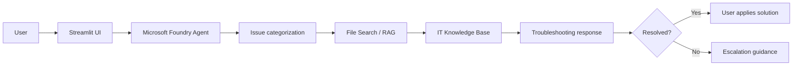
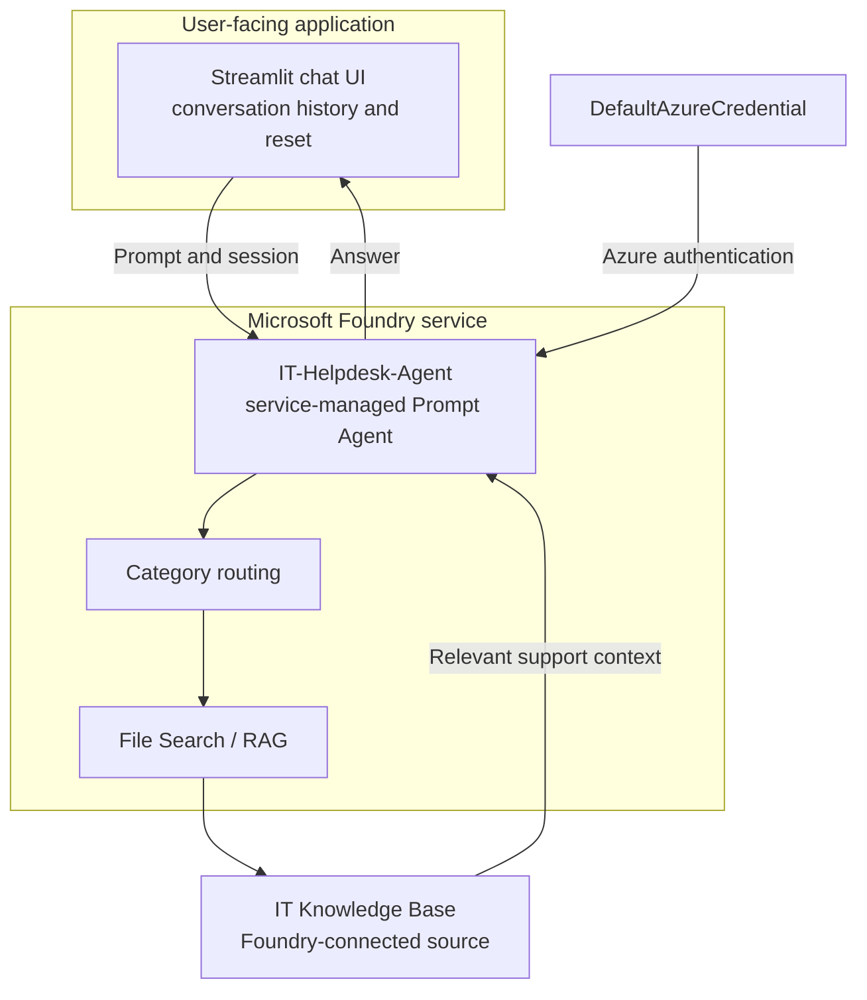

# IT Helpdesk Agent

An AI-powered first-level IT support chat application built with Streamlit and Microsoft Foundry.

## Overview

The IT Helpdesk Agent gives users a conversational way to describe common technical issues and receive troubleshooting guidance. Streamlit provides the chat experience, while a service-managed Microsoft Foundry agent processes the request and returns a response using its configured instructions and knowledge sources.

The project is designed to reduce repetitive first-line support work by helping users find relevant troubleshooting steps before an issue needs human escalation.

## System Workflow



In this repository, the application sends the user's prompt and the current agent session to `IT-Helpdesk-Agent`. Categorization and retrieval are responsibilities of the Foundry agent configuration and its connected knowledge sources; they are not implemented as separate local Python modules.

## Architecture



- **Streamlit** renders the chat interface, stores messages in session state, and starts a new conversation when requested.
- **Microsoft Foundry** hosts the existing `IT-Helpdesk-Agent` and handles the service-managed agent run.
- **File Search / RAG** represents retrieval configured for the Foundry agent. The repository does not contain a local retrieval pipeline.
- **IT Knowledge Base** is the support material connected to the agent configuration. No knowledge-base files or database are stored in this repository.

## Key Features

- Conversational IT support through a Streamlit chat interface
- Persistent conversation messages during the current Streamlit session
- New conversation control that clears the current messages and agent session
- Microsoft Foundry agent integration using the configured project endpoint
- Azure authentication through `DefaultAzureCredential`
- User-visible error handling when the helpdesk agent cannot be reached
- SQLite-backed analytics for real request outcomes, latency, volume, and sanitized failure types

## Support Analytics and Privacy

The in-app **Support analytics** view provides an IT support analytics dashboard that reads actual request events, conversations, user feedback, and tickets from the local `chat_history.db` SQLite database.

The dashboard displays:
- **Support Overview**: Number of distinct support conversations, total support requests, support ticket counts, and agent success rate.
- **Resolved vs. Escalated Issues**: Direct comparison of user-confirmed issue resolutions against unresolved issues requiring escalation, including resolution and escalation rates with side-by-side visualization.
- **Issue Category Distribution**: Distribution of IT issue categories, total categorized issues, category breakdowns, and identification of the most common IT issue category.
- **Usage Trends Over Time**: Daily timeline of support requests and active conversations across selectable time ranges (Last 24 hours, Last 7 days, Last 30 days, All time).
- **System Performance & Observability**: Average response latency, nearest-rank P95 response latency, successful vs. fallback requests, and sanitized failure breakdowns (error stage, error type, and latency).

### Privacy Guarantee
All analytics metrics use structured, aggregated data only. User prompts, full message transcripts, free-form feedback comments, access tokens, and credentials are never stored in or exposed by the analytics dashboard.

## Supported IT Categories

- Wi-Fi / Network
- VPN
- Password / Account
- Printer
- Email
- Software Installation

These categories describe the intended first-level support scope. The repository does not contain a separate local category-classification model.

## Tech Stack

- Python
- Streamlit
- Microsoft Foundry Agent Framework
- Azure Identity
- `python-dotenv`
- `unittest` and Python AST parsing for the smoke test

## Knowledge Base

The application is prepared to work with knowledge sources connected to the Microsoft Foundry agent, including a File Search / RAG workflow. The actual knowledge-base content and retrieval configuration are managed outside this repository and are not embedded in `app.py`.

## Project Structure

```text
.
├── app.py             # Streamlit UI and Foundry agent integration
├── telemetry_store.py # Request telemetry and analytics queries
├── requirements.txt   # Python dependencies
├── test_app.py        # Application smoke test
└── .env               # Local configuration; do not commit secrets
```

## Setup and Run

1. Create and activate a Python virtual environment.

   ```bash
   python -m venv .venv
   ```

   On Windows:

   ```powershell
   .venv\Scripts\Activate.ps1
   ```

2. Install the dependencies.

   ```bash
   pip install -r requirements.txt
   ```

3. Create a local `.env` file with the Foundry project endpoint. Do not commit the file or its values.

   ```env
   FOUNDRY_PROJECT_ENDPOINT=<your-foundry-project-endpoint>
   FOUNDRY_AGENT_VERSION=<optional-agent-version>
   ```

4. Ensure `DefaultAzureCredential` can authenticate with Azure in your development environment.

5. Start the application.

   ```bash
   streamlit run app.py
   ```

6. Run the smoke test when needed.

   ```bash
   python -m unittest test_app.py
   ```

## Example User Queries

- “My laptop can see the Wi-Fi network, but it cannot connect.”
- “How do I connect to the company VPN?”
- “I am locked out of my account and need to reset my password.”
- “The printer is online, but my document is stuck in the queue.”
- “I am not receiving new work emails.”
- “How can I install the approved PDF reader?”

## Current Limitations
 
- Automatic ticket creation from the chat interface is **not implemented** (future scope; tickets table in SQLite is supported for analytics tracking).
- MCP integration is **not implemented**.
- There is no authentication UI in the application.
- Cloud deployment is not included in this repository.
- The local application does not implement its own File Search / RAG pipeline or knowledge-base management.
- Escalation guidance is provided in agent responses; ticket creation requires future backend integration.

## Future Scope

- Add ticket creation and escalation through an approved service or MCP integration.
- Add authenticated user and support-agent views.
- Add structured issue metadata and ticket history storage.
- Expand and version the IT knowledge base with retrieval evaluation.
- Add monitoring, feedback collection, and response-quality metrics.
- Deploy the Streamlit application and Foundry configuration through a documented release process.
